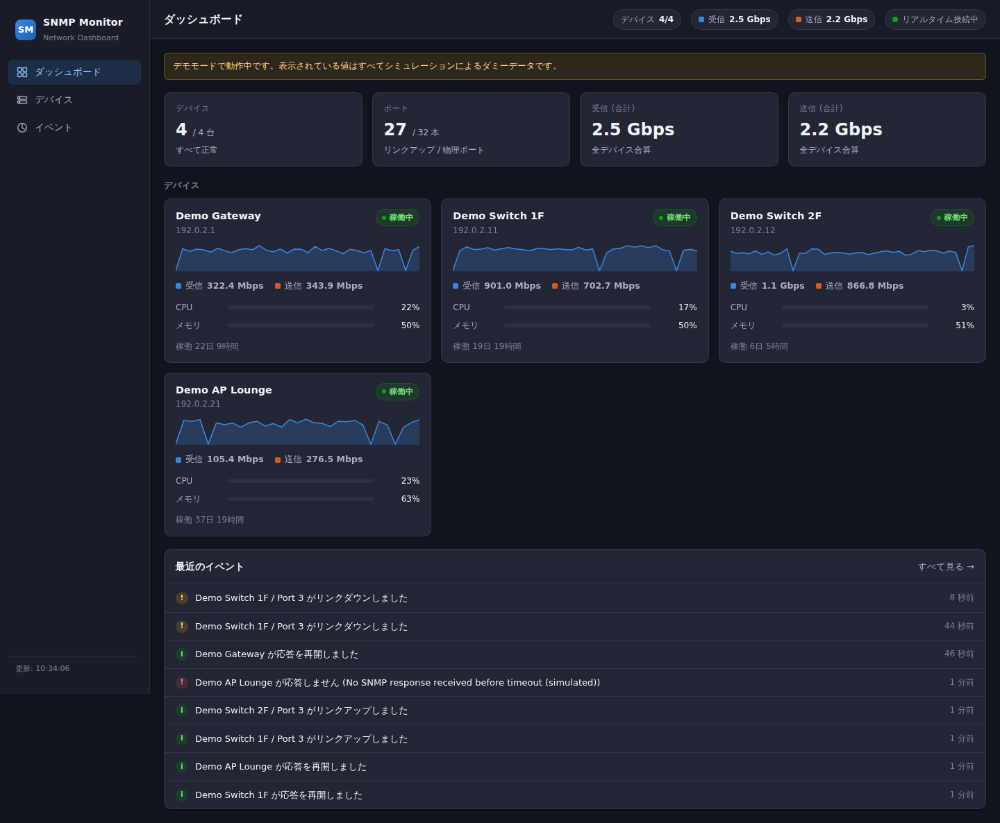
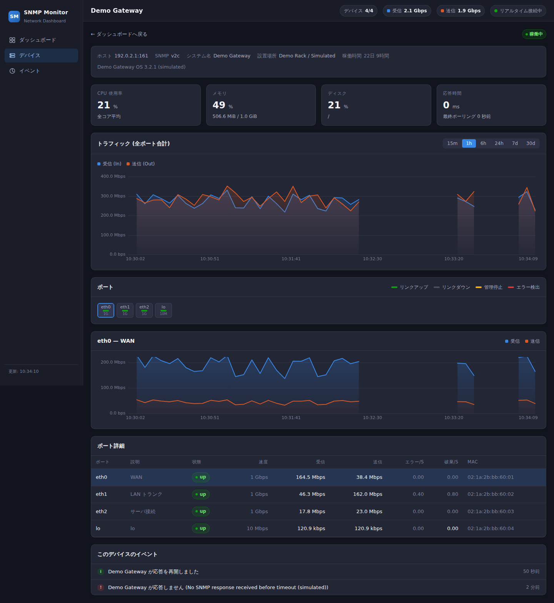

# SNMP Monitor

SNMP でネットワーク機器を定期的にポーリングし、UniFi の Web UI のような画面で
可視化するモニタリングアプリケーションです。Python + FastAPI で動き、
ブラウザだけで参照できます。





## 主な機能

- **インターフェースのトラフィック** — ifHCInOctets / ifHCOutOctets (64bit) から bps を算出。
  64bit カウンタ非対応の機器では自動的に 32bit カウンタへフォールバックします
- **ポート状態** — リンク状態・リンク速度・エラー/破棄カウンタを UniFi 風のポートグリッドで表示
- **システムリソース** — CPU / メモリ / ディスクを HOST-RESOURCES-MIB から取得。
  非対応機器では UCD-SNMP-MIB にフォールバックします
- **死活監視とイベント** — 応答なし・復旧・リンクアップ/ダウン・機器の再起動を検出して記録
- **SNMP v2c / v3 の両対応** — v3 は noAuthNoPriv / authNoPriv / authPriv すべてに対応
- **履歴の保存** — SQLite に保存し、古いデータは 5 分平均・1 時間平均へ自動的に集約 (ダウンサンプリング)
- **リアルタイム更新** — WebSocket でポーリング結果を即座に画面へ反映
- **外部 CDN 非依存** — フロントエンドは依存ライブラリなしの素の JavaScript。
  インターネットに出られない閉じたネットワークでもそのまま動きます

## 必要環境

- Python 3.11 以上
- 監視対象機器で SNMP が有効になっていること

## インストール

```bash
git clone <このリポジトリ>
cd snmp_monitor

python3 -m venv .venv
source .venv/bin/activate
pip install -e .
```

## まずはデモモードで試す

実機がなくても、ダミーのネットワーク機器 4 台をシミュレートして画面を確認できます。
設定ファイルは不要です。

```bash
snmp-monitor --demo
# もしくは: python -m snmp_monitor --demo
```

ブラウザで <http://127.0.0.1:8080> を開いてください。

## 実機を監視する

```bash
cp config.example.yaml config.yaml
# config.yaml を編集してから
snmp-monitor -c config.yaml
```

### 設定ファイルの例

```yaml
server:
  host: 0.0.0.0     # 他の PC からも見る場合
  port: 8080

polling:
  interval_seconds: 30

storage:
  path: data/snmp_monitor.db
  raw_retention_hours: 48

devices:
  # SNMP v2c
  - id: gateway
    name: 拠点ルータ
    host: 192.168.1.1
    tags: [gateway]
    snmp:
      version: "2c"
      community: ${SNMP_COMMUNITY}      # 環境変数から読み込む

  # SNMP v3 (authPriv)
  - id: switch-1f
    name: 1F スイッチ
    host: 192.168.1.10
    snmp:
      version: "3"
      username: monitor
      auth_protocol: sha                # none / md5 / sha / sha224 / sha256 / sha384 / sha512
      auth_key: ${SNMP_AUTH_KEY}
      priv_protocol: aes                # none / des / 3des / aes / aes128 / aes192 / aes256
      priv_key: ${SNMP_PRIV_KEY}
```

- 値の中で `${VAR}` と書くと環境変数に置き換わります (`${VAR:-既定値}` も使えます)。
  コミュニティ文字列や v3 のパスワードを設定ファイルに直接書かずに済みます。
- 監視するポートを絞りたい場合は `interface_include` / `interface_exclude` に
  正規表現を指定してください (例: `interface_exclude: "^(lo|docker|veth)"`)。
- 一時的に監視を止めたいデバイスは `enabled: false` にします。

### 主なコマンドラインオプション

| オプション | 説明 |
| --- | --- |
| `-c`, `--config` | 設定ファイルのパス (既定: `config.yaml`) |
| `--host`, `--port` | 待ち受けアドレス / ポート (設定ファイルより優先) |
| `--demo` | 実機を使わずダミーデータで起動 |
| `--log-level` | `debug` / `info` / `warning` / `error` |

## 監視対象側 (snmpd) の設定例

Linux サーバを net-snmp で監視する場合の `/etc/snmp/snmpd.conf` の例です。

```conf
# --- SNMP v2c ---
rocommunity  your-community  192.168.1.0/24

# --- SNMP v3 (authPriv) ---
createUser   monitor SHA "auth-password" AES "priv-password"
rouser       monitor priv

# HOST-RESOURCES-MIB を有効にしておくと CPU / メモリ / ディスクが取得できます
view systemonly included .1.3.6.1.2.1
```

ネットワークスイッチの場合は、SNMP を有効にしたうえで
`IF-MIB` (必須) と `HOST-RESOURCES-MIB` (任意) が読める権限を与えてください。

## 構成

```
snmp_monitor/
├── config.py        設定ファイルの読み込みとバリデーション
├── models.py        ポーリング結果のデータ構造
├── metrics.py       カウンタ差分から bps を計算 (wrap / 再起動に対応)
├── poller.py        定期ポーリングとイベント検出
├── api.py           FastAPI の REST / WebSocket
├── simulator.py     デモモード用の仮想デバイス
├── snmp/
│   ├── oids.py      使用する OID の定義
│   └── client.py    pysnmp の asyncio ラッパ (v2c / v3)
├── storage/
│   ├── db.py        SQLite 接続とスキーマ
│   └── timeseries.py 保存・集約・削除・参照
└── web/             フロントエンド (依存ライブラリなし)
```

データの流れは次のとおりです。

```
SNMP エージェント → Poller → SQLite (raw → 5m → 1h)
                      ↓
                  WebSocket → ブラウザ
```

## API

| メソッド | パス | 説明 |
| --- | --- | --- |
| GET | `/api/summary` | 全体のサマリとデバイス一覧 |
| GET | `/api/devices` | デバイス一覧 |
| GET | `/api/devices/{id}` | デバイス詳細 (ポート・ストレージを含む) |
| GET | `/api/devices/{id}/interfaces` | ポート一覧 |
| GET | `/api/devices/{id}/history?range=1h` | CPU/メモリと合計トラフィックの履歴 |
| GET | `/api/devices/{id}/interfaces/{ifIndex}/history?range=1h` | ポート単位の履歴 |
| GET | `/api/sparklines?range=15m` | 全デバイスの短い時系列 (一覧表示用) |
| GET | `/api/events?limit=100` | イベント履歴 |
| WS | `/ws` | ポーリング結果のリアルタイム配信 |

`range` に指定できる値: `15m` / `1h` / `6h` / `24h` / `7d` / `30d`

表示期間に応じて解像度が自動的に切り替わります (6 時間以内は生データ、
7 日以内は 5 分平均、それ以上は 1 時間平均)。

## 開発

```bash
pip install -e ".[dev]"

pytest          # テスト (ローカルに実際の SNMP エージェントを立てる結合テストを含む)
ruff check .    # 静的解析
```

テストは以下をカバーしています。

- 設定ファイルの解析とバリデーション
- カウンタの折り返し・機器再起動を含むレート計算
- SQLite への保存、集約 (ロールアップ)、保持期間による削除
- イベント検出 (リンクダウン、応答なし、再起動)
- REST / WebSocket の各エンドポイント
- **実際の SNMP 通信** — pysnmp のコマンドレスポンダをローカルに立て、
  v2c と v3 の各セキュリティレベルで GET / GETBULK が通ることを確認

## トラブルシューティング

**デバイスが「応答なし」のままになる**

- 機器側で SNMP が有効か、監視サーバの IP からのアクセスが許可されているか確認してください
- `snmpwalk -v2c -c <community> <host> system` で手動確認できます
- ファイアウォールで UDP/161 が塞がれていないか確認してください

**SNMPv3 で `Ciphering services not available` と出る**

暗号ライブラリが入っていません。`pip install cryptography` を実行してください
(通常は依存として自動的に入ります)。

**CPU やメモリが表示されない**

機器が HOST-RESOURCES-MIB にも UCD-SNMP-MIB にも対応していない可能性があります。
トラフィックとポート状態は IF-MIB だけで取得できるため、そちらは表示されます。

**トラフィックの値が出るまで時間がかかる**

bps は 2 回のポーリングの差分から求めるため、最初の 1 回目では表示されません。
`interval_seconds` の分だけお待ちください。

## ライセンス

MIT
